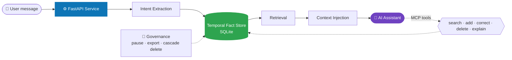
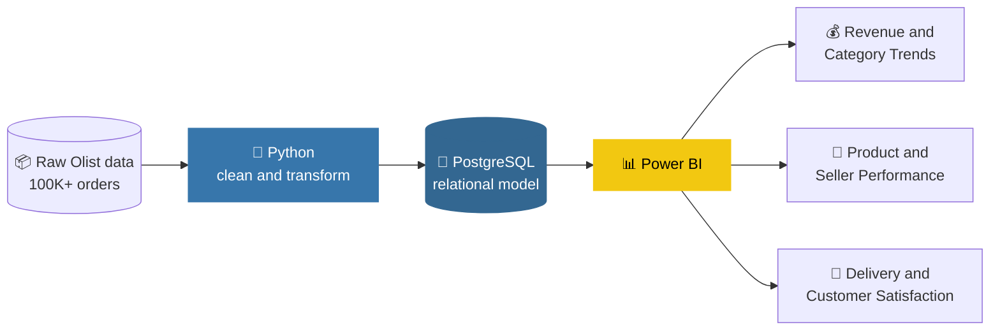
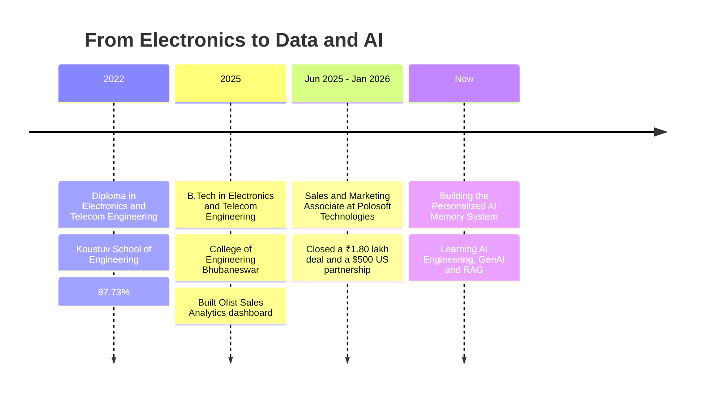

<!-- ===================== HEADER ===================== -->
<div align="center">


<a href="https://github.com/deepsarka">
  
</a>

<br/><br/>


<a href="https://github.com/deepsarka?tab=followers"></a>
<a href="https://www.linkedin.com/in/deep-sarkar-280775201"></a>
<a href="mailto:deepkumarjsr18@gmail.com"></a>

</div>

<br/>

<!-- ===================== ABOUT ===================== -->
## 👋 About Me

```python
class DeepSarkar:
    role        = "Data Analyst"
    location    = "Jamshedpur, Jharkhand, India 🇮🇳"
    education   = "B.Tech, Electronics & Telecommunication Engineering (2025)"
    core_stack  = ["Python", "SQL", "Power BI", "PostgreSQL", "Excel"]
    exploring   = ["GenAI", "LLMs", "RAG", "AI Engineering", "MCP"]
    mindset     = "Every dataset has a story waiting to be told."

    def what_i_do(self):
        return "Turn messy, large datasets into clear dashboards and decisions."
```

I'm a **data-driven 2025 graduate** who builds Power BI dashboards, structures 100K+ records into analytics pipelines with **SQL and Python**, and designs relational databases through self-driven projects. I'm comfortable owning day-to-day **MIS reporting** as well as deeper **trend and variance analysis**, and I'm now extending that foundation into **GenAI / RAG development**.

- 🔭 Currently building a **Personalized AI Memory System** ([repo](https://github.com/deepsarka/personalized-ai-memory-system))
- 🌱 Currently learning **AI Engineering**
- 👯 Looking to collaborate on **AI memory systems** and **analytics projects**
- 💬 Ask me about **Python, SQL, Power BI, Data Visualization, GenAI, LLMs, RAG**
- ⚡ Fun fact: *I believe every dataset has a story waiting to be told.*

<br/>

<!-- ===================== IMPACT ===================== -->
## 📊 Impact at a Glance

<div align="center">

| 🗂️ **100K+** | 📈 **9,000+** | 🏆 **5** | 🚚 **10** | 🧰 **5** |
|:---:|:---:|:---:|:---:|:---:|
| raw order records turned into an analytics pipeline | transactions processed in Power BI dashboards | top-performing categories and sellers identified | delivery bottlenecks surfaced | typed MCP tools defined for AI memory access |

</div>

<br/>

<!-- ===================== TECH STACK ===================== -->
## 🛠️ Tech Stack

<div align="center">

**Analytics and BI**


**AI Engineering and Backend**


<br/>


</div>

**Also comfortable with:** Database Design · Business Intelligence · Requirement Analysis · Problem Solving · MS Office (Word, Excel, PowerPoint) · Communication

<br/>

<!-- ===================== PROJECTS ===================== -->
## 🚀 Featured Projects

| Project | Stack | Highlights | Links |
|:--|:--|:--|:--|
| 🧠 **Personalized AI Memory System** | Python · FastAPI · SQLite · MCP · ChromaDB · Neo4j | Temporal fact store, 5 typed MCP tools, governance controls | [Repo](https://github.com/deepsarka/personalized-ai-memory-system) · [Deploy](https://github.com/deepsarka/backend-deploy) |
| 🛒 **Olist E-Commerce Sales Analytics** | Python · PostgreSQL · Power BI | 100K+ records, 3-page dashboard, 5 top performers, 10 bottlenecks | [Repo](https://github.com/deepsarka/olist-ecommerce-sales-analytics) |

### 🧠 Personalized AI Memory System &nbsp;[](https://github.com/deepsarka/personalized-ai-memory-system) [](https://github.com/deepsarka/backend-deploy)

A governed AI memory system with a **versioned temporal-fact store (SQLite)**, so an AI assistant can recall corrected, timestamped user preferences across sessions.

- ⚙️ **FastAPI** service covering the full memory lifecycle: intent extraction, temporal writes (*supersede, not overwrite*), retrieval, and context injection
- 🧰 **MCP tool manifest** with 5 typed tools: `search`, `add`, `correct`, `delete`, `explain`
- 🔐 **Governance controls:** pause-memory and pause-personalization toggles, data export, and cascading delete
- 🔎 **Next iteration:** semantic retrieval (SentenceTransformers + ChromaDB) and a Neo4j adapter



<br/>

### 🛒 Olist E-Commerce Sales Analytics &nbsp;[](https://github.com/deepsarka/olist-ecommerce-sales-analytics)

Turned **100K+ raw e-commerce order records** into a structured analytics pipeline (**Python → PostgreSQL → Power BI**), giving the business a reliable single source of truth for sales, seller, and delivery performance.

- 📈 **3-page Power BI dashboard** covering revenue and category trends, product and seller performance, and delivery and customer satisfaction
- 🏆 Identified **5 top-performing categories and sellers**
- 🚚 Flagged **10 delivery bottlenecks** to improve customer experience visibility



<br/>

<!-- ===================== JOURNEY ===================== -->
## 🧭 My Journey



<br/>

<!-- ===================== EXPERIENCE ===================== -->
## 💼 Experience

**Sales & Marketing Associate** · *Polosoft Technologies* · June 2025 – Jan 2026

- 💰 Closed a **₹1.80 lakh** project deal with an Indian company and a **$500** partnership deal with a US-based client through outbound calling and consultative selling
- 📞 Made **100+ outbound calls daily** to US-based clients across hotel and data-driven industries
- 📧 Ran LinkedIn outreach and sent **3,000+ bulk emails daily** to generate and nurture leads
- 📑 Reported client data, requirements, and engagement status to management to inform sales strategy and forecasting

<br/>

<!-- ===================== EDUCATION & CERTS ===================== -->
## 🎓 Education & Certifications

| | Details |
|:--|:--|
| 🎓 **B.Tech**, Electronics & Telecommunication Engineering | College of Engineering Bhubaneswar · 2025 · CGPA 7.20/10 |
| 🎓 **Diploma**, Electronics & Telecommunication Engineering | Koustuv School of Engineering · 2022 · 87.73% |
| 📜 **Certification** | Applied Professional Certification in Data Analyst and Business Intelligence |
| 📜 **Certification** | Data Analytics Job Simulation |

<br/>

<!-- ===================== GITHUB STATS ===================== -->
## 📈 GitHub Analytics

<div align="center">


<br/><br/>


<br/>


</div>

<br/>

<!-- ===================== CONNECT ===================== -->
## 🤝 Let's Connect

<div align="center">

<a href="https://www.linkedin.com/in/deep-sarkar-280775201"></a>
<a href="mailto:deepkumarjsr18@gmail.com"></a>
<a href="https://instagram.com/d_sarkar_ram"></a>
<a href="https://drive.google.com/file/d/1fUQPHM3MKCnkAtQCt4czxVH3jy_cPzTY/view?usp=sharing"></a>

<br/><br/>

*Open to **Data Analyst** and **Business Intelligence** roles, and to collaborating on AI projects.*


</div>
